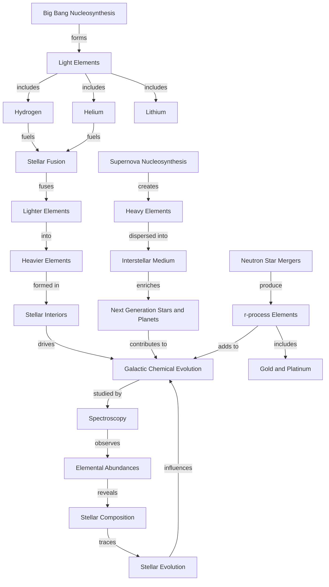

## Concept Map
This concept map shows the relationships between different nucleosynthesis processes, their astrophysical sites, observations, and their importance in cosmic chemical evolution.

**Research question**: How do different astrophysical processes contribute to the chemical enrichment and evolution of the Milky Way galaxy?
**Results between Mind Map and Concept Map**: These two yield different purposes, thus the results are different as well. Mind maps are mainly used for brainstorming ideas meanwhile concept maps are results-oriented (useful for research questions).
